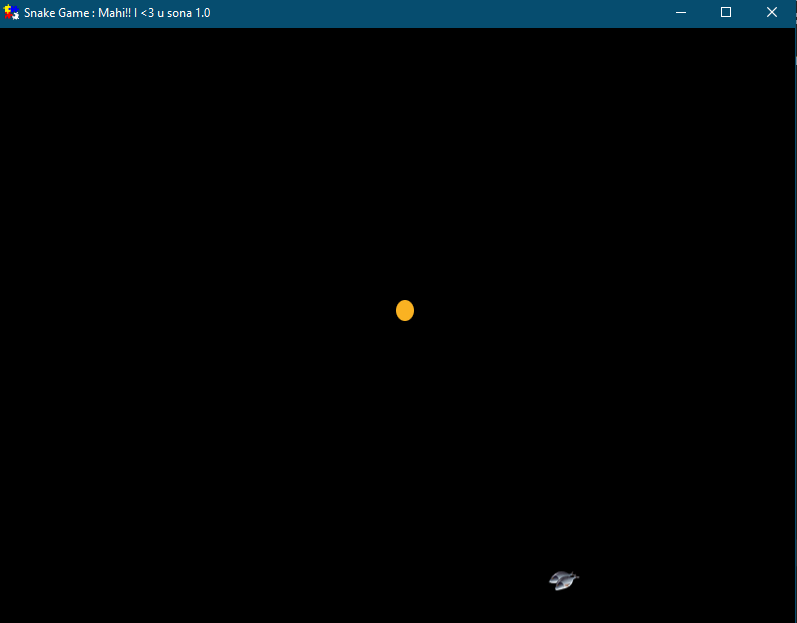
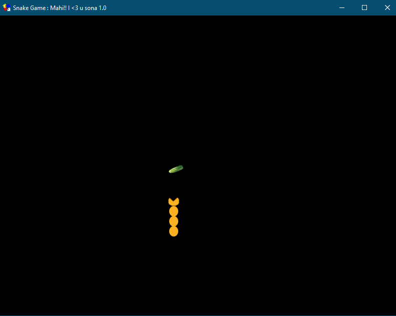
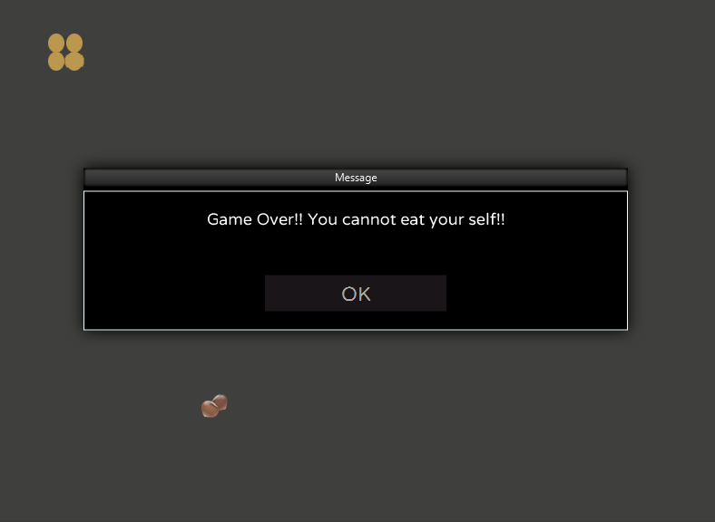

# snake-game

This is a very simple snake game in FXGL. I have created for my daughter. Hope you like it!!

You can find the latest release package [here](https://github.com/amitranjan53/snake-game/releases/download/1.0/SnakeGame-1.0.exe)

Building a project.

```
You need a minimum of openjdk 11
run -> mvn clean install -DskipTests
```

Creating a windows package

```
<path to jdk bin folder>\jpackage -i ./target/ --input ./target/ --main-class com.game.snake.SnakeGame --main-jar snake-game.jar --win-dir-chooser  --app-version 1.0 --copyright "The Unlicense"
```

Game Start


Snake Eating


Game End

